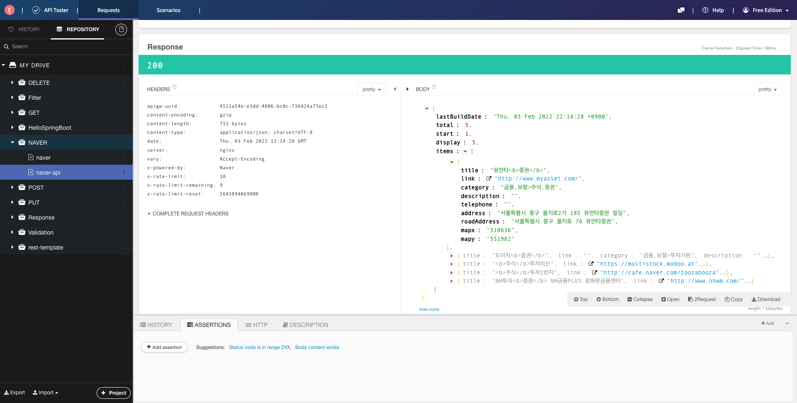
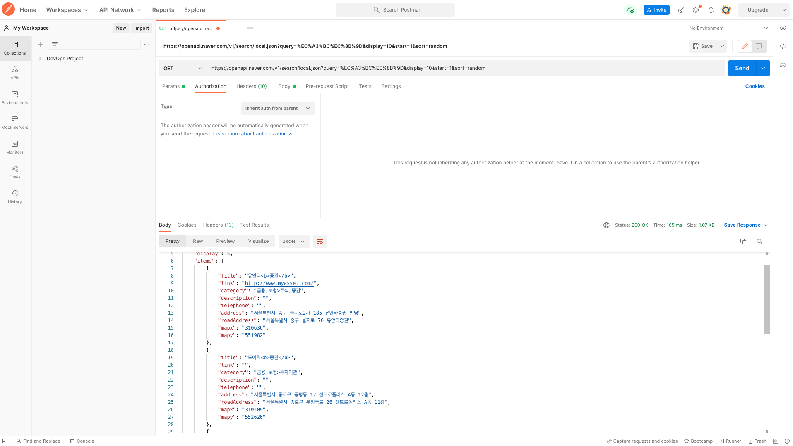

## REST API

- API
  - Application Programming Interface
- REST
  - REpresentational State Transfer
  - 인터넷 상의 시스템 간의 상호 운용성(interoperability)을 제공하는 방법중 하나
  - 시스템 제각각의 독립적인 진화를 보장하기 위한 방법
  - REST API: REST 아키텍처 스타일을 따르는 API
- REST 아키텍처 스타일 ([발표 영상](https://www.youtube.com/watch?v=RP_f5dMoHFc) 11분)
  - Client-Server
  - Stateless
  - Cache
  - Uniform Interface
  - Layered System
  - Code-On-Demand (optional)
- Uniform Interface (발표 영상 11분 40초)
  - Identification of resources
  - manipulation of resources through represenations
  - **self-descrive messages**
  - **hypermedia as the engine of appliaction state (HATEOAS)**
- 두 문제를 좀 더 자세히 살펴보자. (발표 영상 37분 50초)
  - Self-descriptive message
    - 메시지 스스로 메시지에 대한 설명이 가능해야 한다.
    - 서버가 변해서 메시지가 변해도 클라이언트는 그 메시지를 보고 해석이 가능하다.
    - 확장 가능한 커뮤니케이션
  - HATEOAS
    - 하이퍼미디어(링크)를 통해 애플리케이션 상태 변화가 가능해야 한다.
    - 링크 정보를 동적으로 바꿀 수 있다. (Versioning 할 필요 없이!)
- Self-descriptive message 해결 방법
  - 방법 1: 미디어 타입을 정의하고 IANA에 등록하고 그 미디어 타입을 리소스 리턴할 때 Content-Type으로 사용한다.
  - 방법 2: profile 링크 헤더를 추가한다. (발표 영상 41분 50초)
    - [브라우저들이 아직 스팩 지원을 잘 안해](http://test.greenbytes.de/tech/tc/httplink/)
    - 대안으로 [HAL](https://stateless.group/hal_specification.html)의 링크 데이터에 [profile](https://datatracker.ietf.org/doc/html/draft-wilde-profile-link-04) 링크 추가
- HATEOAS 해결 방법
  - 방법1: 데이터에 링크 제공
    - 링크를 어떻게 정의할 것인가? HAL
  - 방법2: 링크 헤더나 Location을 제공

## “Event” REST API

- 이벤트 등록, 조회 및 수정 API
- GET /api/events
- 이벤트 목록 조회 REST API (로그인 안 한 상태)
  - 응답에 보여줘야 할 데이터
    - 이벤트 목록
    - 링크
      - self
      - profile: 이벤트 목록 조회 API 문서로 링크
      - get-an-event: 이벤트 하나 조회하는 API 링크
      - next: 다음 페이지 (optional)
      - prev: 이전 페이지 (optional)
  - 문서?
    - 스프링 REST Docs로 만들 예정
- 이벤트 목록 조회 REST API (로그인 한 상태)
  - 응답에 보여줘야 할 데이터
    - 이벤트 목록
    - 링크
      - self
      - profile: 이벤트 목록 조회 API 문서로 링크
      - get-an-event: 이벤트 하나 조회하는 API 링크
      - create-new-event: 이벤트를 생성할 수 있는 API 링크
      - next: 다음 페이지 (optional)
      - prev: 이전 페이지 (optional)
  - 로그인 한 상태???? (stateless라며..)
    - 아니, 사실은 Bearer 헤더에 유효한 AccessToken이 들어있는 경우!
- POST /api/events
  - 이벤트 생성
- GET /api/events/{id}
  - 이벤트 하나 조회
- PUT /api/events/{id}
  - 이벤트 수정

## Events API 사용 예제

- (토큰 없이) 이벤트 목록 조회
  - create 안 보임
- access token 발급 받기 (A 사용자 로그인)
- (유효한 A 토큰 가지고) 이벤트 목록 조회
  - create event 보임
- (유효한 A 토큰 가지고) 이벤트 만들기
- (토큰 없이) 이벤트 조회
  - update 링크 안 보임
- (유효한 A 토큰 가지고) 이벤트 조회
  - update 링크 보임
- access token 발급 받기 (B 사용자 로그인)
- (유효한 B 토큰 가지고) 이벤트 조회
  - update 안 보임
- REST API 테스트 클라이언트 애플리케이션

  - 크롬 플러그인

    - Talend API Tester

    

  - 애플리케이션

    - Postman

    

## 스프링 부트 프로젝트 만들기
- 추가할 의존성
  * Web
  * JPA
  * HATEOAS
  * REST Docs
  * H2
  * PostgreSQL
  * Lombok
- 자바 버전 11로 시작
  * [자바는 여전히 무료다.](https://medium.com/@javachampions/java-is-still-free-c02aef8c9e04)
- 스프링 부트 핵심 원리
  * 의존성 설정 (pom.xml)
  * 자동 설정 (@EnableAutoConfiguration)
  * 내장 웹 서버 (의존성과 자동 설정의 일부)
  * 독립적으로 실행 가능한 JAR (pom.xml의 플러그인)

## Event 생성 API 구현: Event 도메인 구현

```java
public class Event {

  private String name;
  private String description;
  private LocalDateTime beginEnrollmentDateTime;
  private LocalDateTime closeEnrollmentDateTime;
  private LocalDateTime beginEventDateTime;
  private LocalDateTime endEventDateTime;
  private String location; // (optional) 이게 없으면 온라인 모임
  private int basePrice; // (optional)
  private int maxPrice; // (optional)
  private int limitOfEnrollment;

}
```

- 추가 필드

  ```java
      private Integer id;
      private boolean offline;
      private boolean free;
      private EventStatus eventStatus = EventStatus.DRAFT;
  ```

- EventStatus 이늄 추가

```java
public enum EventStatus {
    DRAFT, PUBLISHED, BEGAN_ENROLLMEND, CLOSED_ENROLLMENT, STARTED, ENDED
}
```

롬복 애노테이션 추가

```java
@Getter @Setter @EqualsAndHashCode(of = "id")
@Builder @NoArgsConstructor @AllArgsConstructor
public class Event {}
```

  * 왜 @EqualsAndHasCode에서 of를 사용하는가 : 엔티티 연관관계 맵핑할때 StackOverflow 방지
  * 왜 @Builder를 사용할 때 @AllArgsConstructor가 필요한가 : 빌더에서 @AllArgsConstructor를 만들어줘서
  * @Data를 쓰지 않는 이유 : 1번과 동일
  * 애노테이션 줄일 수 없나 : 롬복은 메타 애노테이션이 아니기 때문에 줄일수 없다.

## Event 생성 API 구현: 비즈니스 로직
- Event 생성 API
  * 다음의 입력 값을 받는다.
    * name
    * description
    * beginEnrollmentDateTime
    * closeEnrollmentDateTime
    * beginEventDateTime
    * endEventDateTime
    * location (optional) 이게 없으면 온라인 모임
    * basePrice (optional) 
    * maxPrice (optional)
    * limitOfEnrollment
- basePrice와 maxPrice 경우의 수와 각각의 로직

| basePrice | maxPrice |                                              |
|-----------|----------|----------------------------------------------|
| 0         | 100      | 선착순 등록                                       |
| 0         | 0        | 무료                                           |
| 100       | 0        | 무제한 경매 (높은 금액 낸 사람이 등록)                      |
| 100       | 200      | 제한가 선착순 등록 <br> 처음 부터 200을 낸 사람은 선 등록. <br> 100을 내고 등록할 수 있으나 더 많이 낸 사람에 의해 밀려날 수 있음. |

  * 결과값
    * id
    * name
    * ...
    * eventStatus: DRAFT, PUBLISHED, ENROLLMENT_STARTED, ...
    * offline
    * free
    * _links
      * profile (for the self-descriptive message)
      * self
      * publish
      * ...

